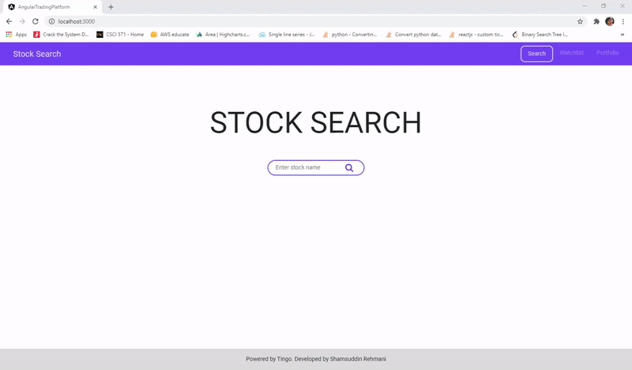

# Stocks Web Application
An Angular web application for virtual stock trading.

## Large Screen Demo

## Small Screen Demo

## Summary
This Angular app provides a platform for stocks trading, including, features such as searching company stock details, buying/selling stocks, keeping track of stock porfolio/watchlist, viewing stock price charts and news, allowing sharing news on twitter and facebook for a given stock, favoriting stocks and tracking their real-time prices with auto-refresh. Express with Nodejs is used as a server proxy for all API calls that uses [Tingo API](https://api.tiingo.com/) for all stock related data, and [News API](https://newsapi.org/) for displaying stock related news. [Highcharts](https://www.highcharts.com/) is used for displaying the chart data for a given ticker.